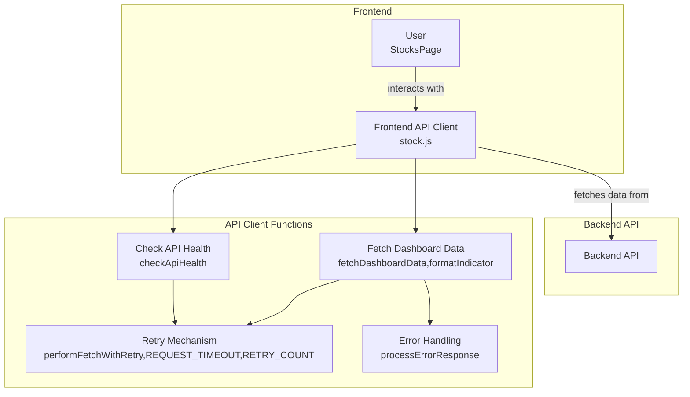

# Codebase Research Report

## Query
Investigate the "Frontend API Client" component in detail. Focus your analysis on these key files:
1. stock.js (c:/Users/nicol/Documents/Kodning_Privat/Startup_company/Ai_Financial_Assistant/frontend/src/services/api/stock.js)

Provide insights about the component's main responsibilities and functionality and how it integrates with other system components

## Answer
### System Diagram

### Summary
# CodeViz Frontend API Client - stock.js

## Overview

This report details the functionality and integration of the `stock.js` (file:c:/Users/nicol/Documents/Kodning_Privat/Startup_company/Ai_Financial_Assistant/frontend/src/services/api/stock.js) file, which serves as a frontend API client for fetching stock-related data.

## Main Responsibilities and Functionality

The `stock.js` module provides functions to interact with the backend API for retrieving stock data and checking API health. Key functions include:

-   **`fetchDashboardData` (node:89):**
    -   Fetches dashboard data from the API based on a provided configuration.
    -   The configuration includes ticker symbol, date range, interval, and selected indicators.
    -   Formats the retrieved data and handles potential errors.
    -   Uses `performFetchWithRetry` (node:88) to handle retries in case of API failures.
    -   Uses `formatIndicator` (node:86) to format the data.
    -   Uses `processErrorResponse` (node:87) to handle error responses from the API.
-   **`checkApiHealth` (node:90):**
    -   Checks the health of the API endpoint.
    -   Uses `performFetchWithRetry` (node:88) to handle retries.
    -   Returns a boolean indicating whether the API is healthy.
-   **`performFetchWithRetry` (node:88):**
    -   A utility function that handles fetching data from the API with a retry mechanism.
    -   It uses `REQUEST_TIMEOUT` (node:81) and `RETRY_COUNT` (node:82) to configure the retry behavior.
-   **`formatIndicator` (node:86):**
    -   Formats the indicator data.
-   **`processErrorResponse` (node:87):**
    -   Processes error responses from the API.
-   **`generateRequestId` (node:85):**
    -   Generates a unique request ID for each API call.

## Integration with Other Components

The `stock.js` module integrates with the `StocksPage` component (node:350) in `frontend/src/pages/stocks/index.js` (file:c:/Users/nicol/Documents/Kodning_Privat/Startup_company/Ai_Financial_Assistant/frontend/src/pages/stocks/index.js).

-   **`StocksPage` Component:**
    -   Uses the `fetchDashboardData` function to fetch stock data and display it in a dashboard.
        -   The `fetchData` function (file:frontend/src/pages/stocks/index.js:171) within `StocksPage` calls `fetchDashboardData` to retrieve the data.
    -   Uses the `checkApiHealth` function to monitor the health of the API.
        -   The `performApiHealthCheck` function (file:frontend/src/pages/stocks/index.js:244) within `StocksPage` calls `checkApiHealth` to check the API health.

## Configuration

The `stock.js` module uses the following configuration parameters:

-   **`API_URL` (node:80):** The base URL of the backend API.
-   **`REQUEST_TIMEOUT` (node:81):** The timeout for API requests.
-   **`RETRY_COUNT` (node:82):** The number of times to retry API requests.
-   **`REFRESH_INTERVAL` (node:83):** The interval at which the API health is checked.
-   **`DEFAULT_KPI_CONFIG` (node:84):** Default configuration for Key Performance Indicators.

## Walkthrough Steps

### 1. Overview of the Frontend API Client
The `stock.js` module acts as a frontend API client, responsible for fetching stock-related data from the backend API. It provides functions to retrieve stock data and monitor API health, serving as an intermediary between the frontend components and the backend services.

### 2. Fetching Dashboard Data
The `fetchDashboardData` function fetches dashboard data from the API based on a provided configuration, which includes the ticker symbol, date range, interval, and selected indicators. It formats the retrieved data using `formatIndicator` and handles potential errors using `processErrorResponse`. The function uses `performFetchWithRetry` to handle retries in case of API failures, ensuring data retrieval even with intermittent API issues.

### 3. Checking API Health
The `checkApiHealth` function checks the health of the API endpoint. It uses `performFetchWithRetry` to handle retries and returns a boolean indicating whether the API is healthy. This function is crucial for monitoring the availability and reliability of the backend API.

### 4. Handling API Requests with Retry Mechanism
The `performFetchWithRetry` function is a utility function that handles fetching data from the API with a retry mechanism. It uses `REQUEST_TIMEOUT` and `RETRY_COUNT` to configure the retry behavior. This function ensures that API requests are retried in case of failures, improving the resilience of the data fetching process.

### 5. Formatting Indicator Data
The `formatIndicator` function formats the indicator data received from the API. This function ensures that the data is in the correct format for display in the frontend components.

### 6. Processing API Error Responses
The `processErrorResponse` function processes error responses from the API. This function handles errors and provides appropriate feedback to the user.

### 7. Integration with StocksPage Component
The `stock.js` module integrates with the `StocksPage` component. The `StocksPage` component uses the `fetchDashboardData` function to fetch stock data and display it in a dashboard. It also uses the `checkApiHealth` function to monitor the health of the API.

## Detailed Sub-Search Results

### 1. How is fetchDashboardData used in index.js?
`fetchDashboardData` is not used in the `index.js` file. The file defines the `Home` component, which is the main landing page for the AI Financial Assistant. It displays a welcome message and feature navigation cards. The component uses `useEffect` for logging component mount/unmount and rendering. It also includes a `handleFeatureClick` function to log user interactions with the feature cards.

### 2. How is checkApiHealth used in index.js?
`checkApiHealth` is not used in `index.js`. The file is the main landing page for the AI Financial Assistant, displaying a welcome message and feature navigation cards. It handles user interactions and logs component lifecycle events.

### 3. What does the fetchData function in frontend/src/pages/stocks/index.js do? Does it use fetchDashboardData from stock.js?
The `fetchData` function (file:frontend/src/pages/stocks/index.js:171) is an `async` function that fetches dashboard data. Here's a breakdown:

- It first checks if `chartSettings.ticker` exists and if `apiStatus.healthy` is true. If either is false, it returns early. (file:frontend/src/pages/stocks/index.js:172)
- It constructs a `requestPayload` object containing: `ticker`, `days`, `interval`, `indicators`, `chartType`, `kpiGroups`, `kpiTimeframe`, and `useCache`. These values are derived from the `chartSettings` and `kpiPreferences` states. (file:frontend/src/pages/stocks/index.js:175-184)
- It sets the `dashboardData` state to `loading: true` and `error: null`. (file:frontend/src/pages/stocks/index.js:187)
- It calls `fetchDashboardData` with the `requestPayload`. (file:frontend/src/pages/stocks/index.js:190)
- If the fetched data contains an `error` property, it updates the `dashboardData` state with the error message and sets `chartHasError` to `true`. (file:frontend/src/pages/stocks/index.js:193-199)
- If the fetched data is successful (no error), it updates the `dashboardData` state with the `chart_data`, `kpi_data`, `marketHours`, and `companyInfo` from the response and sets `chartHasError` to `false`. (file:frontend/src/pages/stocks/index.js:201-212)
- If any error occurs during the `fetchDashboardData` call, it catches the error, updates the `dashboardData` state with the error message, and sets `chartHasError` to `true`. (file:frontend/src/pages/stocks/index.js:213-221)

Yes, the `fetchData` function uses `fetchDashboardData` from `../../services/api/stock` (file:frontend/src/pages/stocks/index.js:5).

### 4. What does the performApiHealthCheck function in frontend/src/pages/stocks/index.js do? Does it use checkApiHealth from stock.js?
The `performApiHealthCheck` function (file:frontend/src/pages/stocks/index.js:244) is an `async` function defined within a `useEffect` hook. It checks the health of the API and updates the `apiStatus` state.

Here's what it does:

1.  It retrieves a unique ID for the component instance.
2.  It logs an info message indicating that it's checking the API health.
3.  It calls the `checkApiHealth()` function (file:frontend/src/pages/stocks/index.js:248).
4.  It updates the `apiStatus` state based on the result of `checkApiHealth()`. If `checkApiHealth()` returns `true`, it sets `apiStatus.healthy` to `true` and sets the message to `API_MESSAGES.CONNECTED`. Otherwise, it sets `apiStatus.healthy` to `false` and sets the message to `API_MESSAGES.FAILED`.
5.  If an error occurs during the health check, it logs an error message and sets `apiStatus.healthy` to `false` with an appropriate error message.

Yes, it uses `checkApiHealth` which is imported from `'../../services/api/stock'` (file:frontend/src/pages/stocks/index.js:5).

---
*Generated by [CodeViz.ai](https://codeviz.ai) on 6/6/2025, 11:33:12 AM*
